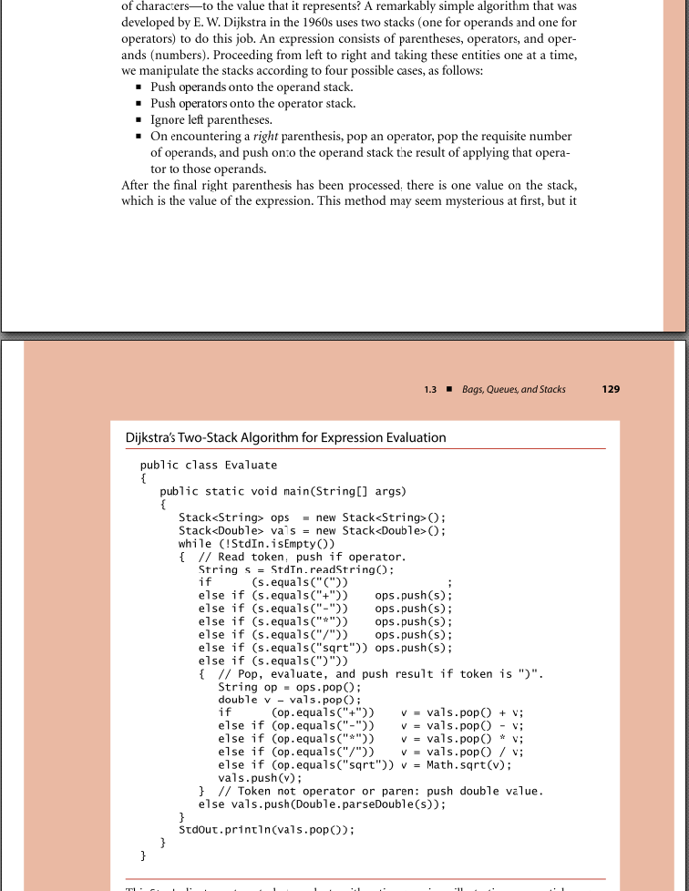
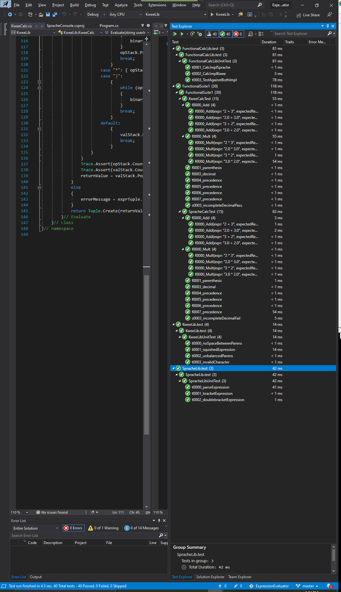

- [ExpressionEvaluator](#expressionevaluator)
  - [1. Problem statement](#1-problem-statement)
  - [2. Clarifications](#2-clarifications)
  - [3. Additional assumptions](#3-additional-assumptions)
- [Preliminary research](#preliminary-research)
- [Implementation details](#implementation-details)
- [Basic build information](#basic-build-information)
- [Design](#design)
  - [The functional API](#the-functional-api)
- [Code/Test organization](#codetest-organization)
  - [1. lib](#1-lib)
  - [2. console](#2-console)
  - [3. functionaltest](#3-functionaltest)
    - [dotnet session](#dotnet-session)
    - [Visual Studio session](#visual-studio-session)

# ExpressionEvaluator
This is the programming assignment for an SDET Test and Automation position.
## 1. Problem statement
 Write a program to evaluate arithmetic expressions.  Input will be text expression strings.  Here are some examples:
 5 + 14
 (8 + 2) * 4
 7 + 3 + 9
 (6 + 5) * (8 + 2)

 Your solution should:
 * Demonstrate the ability to parse/evaluate arithmetic expressions
 * Support addition and multiplication and be easily extensible to add other operations later
 * Be designed and implemented in an object-oriented manner
 * Not use the "Shunting Yard" algorithm
 * Contain a testing framework to validate that the solution is functioning as desired
 * Use whatever tools and languages you are most comfortable with
## 2. Clarifications
The main clarification was on why/whether the Shunting Yard (SY) algorithm should not be used.

> The requirement asked that I not use SY. The wiki page indicates SY is an algorithm for parsing mathematical  expressions specified in infix notation. It can also
> be used to convert an infix notation to a pre/post fix notation.
> Sedgewick calls it Dijkstra's Two-Stack algorithm. Many online examples use SY without mentioning it. The tell-tale sign is probably the single pass that
> makes it ideal in implementation and memory resource.
>
> Anyway, I gather the requirement not to use SY boils down to :
> 1) don't convert to infix/postfix
> 2) don't use 2 stacks.
>
> Is that your intent?

The intent is that you not copy a readily available solution from the Internet. We want to see an approach that you design and implement.
It is okay for you to use available language libraries to help you out.
For example, if the language you use has library classes/functions for breaking a string into tokens, you can use the library and not write a tokenizer from scratch.

## 3. Additional assumptions
1) Numbers are base10
2) The input is like a 4-function calculator with 8 digits of display. 
   Keys to enter input are 0 to 9 numbers, decimal point, braces and RET.
   There is no entry for scientific notation, although the results may show up in that notation.
   There is no entry for very large symbolic numbers such as int.MaxValue
3) The operators "+" and "*" are binary operators. The addition of other operations would also be binary, ie
   "-" and "/**. These can be conditionally compiled with the pragma #define MOREOPERATORS.
4) Unary operators are excluded for now.
   Leading signs such as +5 and -5 are considered unary operators.
   Other unary operators are sqrt etc.
   The code can accomodate unary operators and their precedence but it is less trivial.

# Preliminary research
Initial research suggests that for industrial strength parsing, it is advisable to use something like Antlr.
Since this project is for learning, I found a lightweight C# parser that I thought I could leverage upon.
It is called [Sprache]( https://github.com/sprache/Sprache). A separate article ["Sprache.Calc: Building Yet Another Expression Evaluator"](https://www.codeproject.com/Articles/795056/Sprache-Calc-Building-Yet-Another-Expression-Evalu) even gave the implementation for a simple calculator.  Instead of just coping the pattern, I decided to adopt this as a test buddy. Eventually, it would then be used to compare its output
to that of the expression evaluator I will write.

I tried to devise an algorithm for evaluating an arbitary infix expression and ran into many problems.
After clarifying the reasons for being able to reimplement the SY algorithm, I decided that it would be
safe to re-implement it from Sedgewick's 4 line description ( Sedgewicks Algorithms 4th edition, Chapter 1
Section 1.3 on 'Arithmetic expression evaluation') 
   1. Push operands onto the operand stack.
   2. Push operators onto the operator stack.
   3. Ignore left parentheses.
   4. On encountering a right parenthesis, pop an operator, pop the requisite number of operands, and push onto the operand stack the result of applying that operator to those operands.

There is also a complete java code implementation for reference.

# Implementation details
* Version Control : [Github](https://github.com/khtan/ExpressionEvaluator)
* Continuous Integration : [CircleCI](https://circleci.com/gh/khtan/ExpressionEvaluator)
* Test framework : console and XUnit.Net
* Software environment : dotnet 3.1 and Visual Studio 2019 Community

# Basic build information
**Getting the code:**
   > git clone https://github.com/khtan/ExpressionEvaluator.git

**Building the code with VS Community 2019:**

   Open the ExpressionEvaluator.sln file and do a build.
   To run tests, click on the Test/Test Explorer and then select Run All Tests or Run as desired.

**Building the code with dotnet:**

   There is also a way to build/run on the shell, using the dotnet command line. This is how CircleCi does it.
   Change directory in the shell to the root of the project
   > dotnet restore // to pull in the dependencies

   > dotnet test // to run all the tests
   
   If you need to install dotnet core, look at [Microsoft Install .NET Core on Windows](https://docs.microsoft.com/en-us/dotnet/core/install/windows?tabs=netcore31). There is a button to "Download .NET Core" which can be run to install.
   
# Design
## The functional API

Given that we have one function to implement, it would seeem that the api would be quite simple. In C# parlance,
it would be Func<string, Double). While that is minimal, it would be more useful to consider error conditions as well.

Below is an excerpt from Calc.cs that implements this functional interface.

    /// 

    /// The fundamental functional interface is Func<string, Tuple<dynamic?, string?>>, ie
    /// the input is an expression ( string **
    /// and the output is a Tuple. 
    /// The first value of the Tuple is a nullable dynamic, representing the value of the expression, if it evaluates without error.
    /// The null would represents a bad evaluation.
    /// The second value of the Tuple is a nullable string, representing the error message if any.
    /// The null represents no errors.
    /// 
    /// This library provides two implementations of the expression evaluator.
    /// The KweeCalc is written by yours truly.
    /// The SimpleCalculator is a test buddy.
    /// 

## Incrementally improving on Sedgewick's algorithm

* Try to keep the original structure intact
* Keep the Evaluate function simple by ensuring that the input is cleaned up or rationalized

Helper functions are used to check the user input string : HasEmptyConstructs, HasMalformedConstructs, hasValidCharacters, isParenBalanced. After these checks, ensureSingleSpace expands all the keywords with spaces, and then the multiple spaces are collapsed to single space. 

This results in a rationalized string that is useable by Evaluate without too much check.

* The Sedgewick code did not take into account operator precedence and its interaction with the left "("
* The CiCd process helps to automate the mundance stuff such as 
  1. I tend to work on Debug builds, so I set CircleCi to run the tests on Release. This eliminates a source of issue.
  2. I work on Windows, so I set CircleCi to run the tests on Linux and Windows. It is amazing that the Linux docker machine
     is typically 2x faster than the Windows virtual machine.
  3. Automatic regression detection
* Found that the use of a Tuple to return value and error message allows a more functional flow of processing.
  This is akin to the functional types Option and Either.

## Adding more binary operators
The code uses #define MOREOPERATORS to show where the changes are in order to support the other 2 binary
operators "-" and "/". There is a small set of tests that checks the 2 additional binary operators as well.

    > grep -r MOREOPERATORS .
    > ./functionaltest/FunctionalSuite1/KweeCalcTest.cs:// #define MOREOPERATORS
    > ./functionaltest/FunctionalSuite1/KweeCalcTest.cs:#if MOREOPERATORS
    > ./lib/KweeLib/KweeCalc.cs:// #define MOREOPERATORS
    > ./lib/KweeLib/KweeCalc.cs:#if MOREOPERATORS
    > ./lib/KweeLib/KweeCalc.cs:#if MOREOPERATORS
    > ./lib/KweeLib/KweeCalc.cs:#if MOREOPERATORS
    > ./lib/KweeLib/KweeCalc.cs:#if MOREOPERATORS
    > ./lib/KweeLib/KweeCalc.cs:#if MOREOPERATORS
    > ./lib/KweeLib/KweeCalc.cs:#if MOREOPERATORS
    > 
## Adding unary operators
* Might have to distinguish between a unary -2 and a binary 5-2
* The precedence rules still remain at 2 levels, {+,-} and {*,/}
* Also depends whether we want prefix or post fix unary

# Code/Test organization

The code is organized into 3 folders :
## 1. lib

This contains the source code for the libraries.

Each library <libraryName> has its accompanying <libraryName>.test that is its companion unit tests.

    Library                | Description
    -----------------------|---------------------------------------------------------------------------------
    KweeLib                | Implementation for Expression Evaluator
    KweeLib.test           | unit tests for KweeLib
    SpracheLib             | Test buddy from Sprache.Calc
    SpracheLib.test        | unit tests for SpracheLib
    FunctionalCalcLib      | Implementation of functional interface, to isolate from SpracheLib and KweeLib
    FunctionalCalcLib.test | unit tests for FunctionalCalcLib
    
## 2. console
This provides console drivers that wraps the functionality in the libraries for convenient and direct use.
It also uses the functional interface instead of directly using the libraries.
It is a minimal console and does not have help options etc. 
It is useful for quick and manual testing, although it can be used in automation by simple file redirection.

   Console        | Path to executable
   ---------------|--------------------------------------------------------------------
   KweeConsole    | console\KweeConsole\bin\Debug\netcoreapp3.1\KweeConsole.exe
   SpracheConsole | console\SpracheConsole\bin\Debug\netcoreapp3.1\SpracheConsole.exe

The console application will accept user input and writes out the value evaluated or an error message.
When you are done, entering Ctrl-C will end the input stream. This also allows the user to redirect inputs from a file.

Below is an annotated transcript for more details :

    >  c:\cprojects\github\circleci\ExpressionEvaluator\console>ls
    >  KweeConsole
    >  SpracheConsole
    >  test1.input
    >  test2.input

test1.input and test2.input are sample input files
 
    >  c:\cprojects\github\circleci\ExpressionEvaluator\console>KweeConsole\bin\Debug\netcoreapp3.1\KweeConsole.exe
    >  1 + 2
    >  i: 1 + 2
    >  3
    >  3 * 3
    >  i: 3 * 3
    >  9
    >  ^C

Above is a sample user interaction session. Note the annoying echoing of the input ( prefixed with i: )

    > KweeConsole\bin\Debug\netcoreapp3.1\KweeConsole.exe < test1.input
    > i:  5 + 14
    > 19
    > i: (8 + 2) * 4
    > 40
    > i: 7 + 3 + 9
    > 19
    > i: (6 + 5) * (8 + 2)
    > 110
    > 
Above is how to redirect test1.input to the console. Note the reason for the echoing of the input.

    > c:\cprojects\github\circleci\ExpressionEvaluator\console>cat test1.input
    > cat test1.input
    > 5 + 14
    > (8 + 2) * 4
    > 7 + 3 + 9
    > (6 + 5) * (8 + 2)
    
Above shows the content of test1.input

## 3. functionaltest

This is the functional test library for both KweeCalc and SpracheCalc. They can be run from Visual Studio or
dotnet cli.

   File                 | Purpose 
   ---------------------|----------------------------------------------------------------
   KweeCalcSmokeTest.cs | The first 4 expressions provided in the problem statement
   KweeCalcTest.cs      | The functional tests, using CalcImplKwee
   SpracheCalcTest.cs   | The same functional tests, using CalcImplSprache
   CommonCalcTest.cs    | Reusable tests that are common between KweeCalc and SpracheCalc

There is a simple naming convention for the tests : {prefix-char}{4 digit number}_{shortdescription}

   Prefix | Meaning                                                             | Example
   -------|---------------------------------------------------------------------|-----------------------------------------------------------------------
   t      | test                                                                | CommonCalcTest/t0004_precedence
   s      | self test, specific to only KweeCalc or SpracheCalc                 | SpracheCalcTest/s0010_malformedFail, KweeCalcTest/s0010_malformedPass
   f      | shared (forwarded) test, so that they actually call a common t test | KweeCalcTest/f0004_precedence, SpracheCalcTest/f0004_precedence

   In the above examples, KweeCalcTest/f0004_precedence and SpracheCalcTest/f0004_precedence both call the same test in CommonCalcTest/t0004_precedence.
   The test KweeCalcTest/s0010_malformedPass indicates that KweeCalc handles this set of conditions while SpracheCalcTest/s0010_malformedFail does not.
   The failure is checked against the error message, and is condiered a "pass" in the testing framework.
   
   
   The 4 digit number is used to provide an ordering, to show either how the functions got developed or the recommended sequence
   when a new user/engineer needs to understand the tests. Otherwise, it is a bunch of loosely coupled tests and makes it harder
   to understand the scope of all the tests.
   
### dotnet session
Below is a transcript showing how to run all the unit and functional tests using dotnet.

    > c:\cprojects\github\circleci\ExpressionEvaluator>dotnet restore
    > dotnet restore
    >   Determining projects to restore...
    >   Restored c:\cprojects\github\circleci\ExpressionEvaluator\lib\KweeLib\KweeLib.csproj (in 275 ms).
    >   Restored c:\cprojects\github\circleci\ExpressionEvaluator\lib\SpracheLib\SpracheLib.csproj (in 350 ms).
    >   Restored c:\cprojects\github\circleci\ExpressionEvaluator\console\SpracheConsole\SpracheConsole.csproj (in 354 ms).
    >   Restored c:\cprojects\github\circleci\ExpressionEvaluator\console\KweeConsole\KweeConsole.csproj (in 350 ms).
    >   Restored c:\cprojects\github\circleci\ExpressionEvaluator\lib\FunctionalCalcLib\FunctionalCalcLib.csproj (in 354 ms).
    >   Restored c:\cprojects\github\circleci\ExpressionEvaluator\lib\SpracheLib.test\SpracheLib.test.csproj (in 148 ms).
    >   Restored c:\cprojects\github\circleci\ExpressionEvaluator\lib\KweeLib.test\KweeLib.test.csproj (in 473 ms).
    >   Restored c:\cprojects\github\circleci\ExpressionEvaluator\lib\FunctionalCalcLib.test\FunctionalCalcLib.test.csproj (in 473 ms).
    >   Restored c:\cprojects\github\circleci\ExpressionEvaluator\functionaltest\FunctionalSuite1\FunctionalSuite1.csproj (in 474 ms).
    > 
The above restores the dependencies.

    > c:\cprojects\github\circleci\ExpressionEvaluator>dotnet test
    > dotnet test
    > Test run for c:\cprojects\github\circleci\ExpressionEvaluator\lib\KweeLib.test\bin\Debug\netcoreapp3.1\KweeLib.test.dll(.NETCoreApp,Version=v3.1)
    > Test run for c:\cprojects\github\circleci\ExpressionEvaluator\lib\SpracheLib.test\bin\Debug\netcoreapp3.1\SpracheLib.test.dll(.NETCoreApp,Version=v3.1)
    > Microsoft (R) Test Execution Command Line Tool Version 16.6.0
    > Copyright (c) Microsoft Corporation.  All rights reserved.
    > 
    > Microsoft (R) Test Execution Command Line Tool Version 16.6.0
    > Copyright (c) Microsoft Corporation.  All rights reserved.
    > 
    > Starting test execution, please wait...
    > Starting test execution, please wait...
    > Test run for c:\cprojects\github\circleci\ExpressionEvaluator\functionaltest\FunctionalSuite1\bin\Debug\netcoreapp3.1\FunctionalSuite1.dll(.NETCoreApp,Version=v3.1)
    > 
    > A total of 1 test files matched the specified pattern.
    > 
    > A total of 1 test files matched the specified pattern.
    > Test run for c:\cprojects\github\circleci\ExpressionEvaluator\lib\FunctionalCalcLib.test\bin\Debug\netcoreapp3.1\FunctionalCalcLib.test.dll(.NETCoreApp,Version=v3.1)
    > Microsoft (R) Test Execution Command Line Tool Version 16.6.0
    > Copyright (c) Microsoft Corporation.  All rights reserved.
    > 
    > Microsoft (R) Test Execution Command Line Tool Version 16.6.0
    > Copyright (c) Microsoft Corporation.  All rights reserved.
    > 
    > Starting test execution, please wait...
    > 
    > A total of 1 test files matched the specified pattern.
    > Starting test execution, please wait...
    > 
    > A total of 1 test files matched the specified pattern.
    > 
    > Test Run Successful.
    > Total tests: 4
    >      Passed: 4
    >  Total time: 1.6196 Seconds
    > 
    > Test Run Successful.
    > Total tests: 3
    >      Passed: 3
    >  Total time: 1.6048 Seconds
    > 
    > Test Run Successful.
    > Total tests: 64
    >      Passed: 64
    >  Total time: 1.6612 Seconds
    > 
    > Test Run Successful.
    > Total tests: 3
    >      Passed: 3
    >  Total time: 1.6621 Seconds
    > 
The above runs the tests with results.

### Visual Studio session
If you are using Visual Studio 2019 Community, the Test Explorer can be used.

